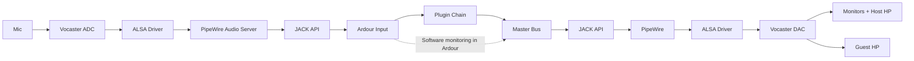

# SG9 Studio — Setup & Reference Manual

**Document Version:** 2.0 | **Last Updated:** 2026-01-19

This manual documents the SG9 Studio broadcast workflow using Ardour 8, the Focusrite Vocaster Two,
and FLOSS plugins. It standardizes on **software monitoring** in Ardour while the Vocaster provides
clean I/O and physical volume control.

## Quick Start (Daily)

- Power on the Vocaster Two and confirm your saved routing in `alsa-scarlett-gui`.
- Open Ardour and load the SG9 session/template.
- Monitor on **Guest headphones** (primary reference). Set comfortable levels with the hardware knobs.
- Arm what you need:
  - Track 1: Host Mic (processed)
  - Track 2: Host Mic (raw safety)
  - Track 5: Aux input (phone/tablet)
  - Track 7: Remote guest
- Pre-show checks (30–60 seconds):
  - No double monitoring (voice sounds clean, not phasey)
  - Remote echo check (guest does not hear themselves)
  - Loudness check: play 30 seconds and verify **-16 LUFS ±2 LU** and **TP ≤ -1.0 dBTP**

## Quick Start (First-Time Setup)

1. Configure hardware routing in [ALSA routing](#alsa-routing-vocaster--alsa-scarlett-gui).
2. Follow the comprehensive [Ardour 8 Template Setup Guide](ARDOUR-SETUP.md) to configure your session, tracks, busses, VCAs, and processing chains.
3. Verify loudness targets in [Loudness, LRA, & Metering](#loudness-lra--metering).

## Signal Flow



**Audio Stack:** Hardware (Vocaster) → ALSA driver → PipeWire → JACK API → Ardour  
**Hardware Routing:** ALSA (via alsa-scarlett-gui) | **Audio Server:** PipeWire | **Ardour Backend:** JACK

## Hardware Overview

### Vocaster Two I/O

**Inputs**

- Host XLR (rear): primary mic
- Guest XLR (rear): optional guest mic
- Aux (front, 3.5 mm): phone/tablet
- Bluetooth: optional wireless audio
- USB: multichannel I/O to/from computer

**Outputs**

- Monitor L/R (rear TRS)
- Host headphones (front)
- Guest headphones (front, primary monitoring)

**Output topology**

- **Destination A:** Monitors + Host headphones (shared)
- **Destination B:** Guest headphones (independent)

## Monitoring Model (Software Monitoring)

SG9 Studio uses **software monitoring in Ardour**.

- Ardour controls **monitoring content** (what you hear).
- The Vocaster controls **physical loudness** only.
- Do **not** rely on the Vocaster mixer for monitoring content.

**Practical rule**: Set hardware knobs once for comfort, then mix entirely in Ardour.

## ALSA Routing (Vocaster + alsa-scarlett-gui)

**Goal:** Route raw inputs to Ardour and route Ardour’s master output to all destinations.

### Minimal routing map

| Source (Hardware) | → | Sink (USB to Ardour) | Purpose |
| --- | --- | --- | --- |
| Analogue 1 | → | PCM 01 | Host mic → Track 1 |
| Analogue 2 | → | PCM 05 | Guest mic → Track 2 |

| Source (USB from Ardour) | → | Sink (Hardware Output) | Purpose |
| --- | --- | --- | --- |
| PCM 01/02 | → | Analogue 1/2 | Monitors L/R |
| PCM 01/02 | → | Analogue 3/4 | Host HP L/R |
| PCM 01/02 | → | Analogue 5/6 | Guest HP L/R |

**Optional loopback for music capture**

| Source | → | Sink | Purpose |
| --- | --- | --- | --- |
| PCM 03/04 | → | PCM 03/04 | External audio → Ardour loopback track |

## Ardour Configuration

For complete Ardour 8 session setup including tracks, busses, VCAs, processing chains, MIDI controllers, and modern workflow features, see the [Ardour 8 Template Setup Guide](ARDOUR-SETUP.md).

**Quick reference:**
- **Monitoring Model:** Software Monitoring (Ardour controls content, Vocaster controls volume)
- **Audio System:** JACK (via PipeWire) with Vocaster Two
- **Sample Rate:** 48 kHz
- **Buffer Size:** 128–256 samples (adjustable based on CPU)
- **Processing Order:** HPF → Gate → De-esser (LSP SC) → EQ → Compressor → Limiter

## Loudness, LRA, & Metering

### Platform targets

| Platform | Integrated Loudness | True Peak Max | Notes |
| --- | --- | --- | --- |
| Apple Podcasts | -16 LUFS | -1.0 dBTP | Stereo target |
| Spotify | -14 LUFS | -1.0 dBTP | Normalized playback |
| YouTube | -14 LUFS | -1.0 dBTP | Loudness normalized |
| Amazon | -14 LUFS | -2.0 dBTP | More conservative TP |
| EBU R128 | -23 LUFS ±0.5 | -1.0 dBTP | Broadcast standard |

**Recommendation:** Produce at **-16 LUFS** for broadest compatibility, then derive other targets if needed.

### LRA targets

- Podcast: **4–10 LU**
- Broadcast: **5–15 LU**

If LRA is too low, ease compression. If too high, increase compression or tighten thresholds.

### Metering recommendations

- **Ardour Loudness Analyzer** (EBU R128)
- **x42-meter** for True Peak
- **Calf Analyzer** for spectrum + phase

## Redundancy Recording (Raw Safety)

Record a raw, unprocessed mono track in parallel with the processed chain.

- **Why:** Recovery from over-processing, clipping, or plugin issues.
- **Disk budget:** 48 kHz / 24-bit mono ≈ 8.2 MB per minute.
- **Recovery workflow:** Align the raw track, then reprocess with the canonical chain.

## Operational Workflows

### Solo recording

1. Arm Host Mic (DSP) and Host Mic (Raw).
2. Verify monitoring is from Ardour (no hardware mix).
3. Record.

### Remote interview

1. Arm Host Mic, Raw, and Remote Guest tracks.
2. Confirm mix-minus is generated in Ardour (no return in VoIP send).
3. Record.

### Aux guest

1. Plug device into Aux.
2. Arm Aux track.
3. Level match and record.

### Preflight validation

- Send test tone to Playback 1–2 and 3–4 to confirm destination mapping.
- Verify no echo on remote call (guest does not hear themselves).
- Play 30 seconds of content and verify **-16 LUFS ±2** and **TP ≤ -1.0 dBTP**.

## Troubleshooting

**Voice sounds phasey**

- Ensure hardware monitoring is off and Ardour is monitoring.

**Remote guest hears themselves**

- Remove return audio from the VoIP send bus.

**Levels feel inconsistent**

- Re-check gain staging: input peaks -18 to -12 dBFS pre-plugins.

**True Peak overs**

- Increase limiter oversampling and lower ceiling to -1.5 dBTP if needed.

## Appendices

### Appendix: Audio Backend Architecture (PipeWire/JACK)

**SG9 Studio uses PipeWire with JACK compatibility layer.**

**Audio Stack Layers:**

1. **Hardware Layer:** Focusrite Vocaster Two (USB audio interface)
2. **ALSA Driver:** Low-level kernel driver for hardware communication
3. **PipeWire:** Modern audio server providing JACK API compatibility
4. **JACK API:** Industry-standard pro audio interface used by Ardour
5. **Application Layer:** Ardour 8 DAW

**Key Configuration:**

- **Sample Rate:** 48 kHz (configurable via PipeWire)
- **Buffer Size:** 128–256 samples (typical for broadcast)
- **Quantum:** PipeWire's equivalent to JACK buffer size
- **CPU Governor:** Should be set to "performance" mode for low-latency

**PipeWire Quantum Settings:**

```conf
# ~/.config/pipewire/pipewire.conf.d/custom.conf
context.properties = {
    default.clock.rate = 48000
    default.clock.quantum = 1024     # Default buffer size
    default.clock.min-quantum = 32   # Minimum allowed
    default.clock.max-quantum = 8192 # Maximum allowed
}
```

**Why PipeWire + JACK?**

- **Unified Audio:** Single server handles both desktop audio and pro audio
- **JACK Compatibility:** Ardour sees standard JACK API
- **Low Latency:** Comparable to native JACK (<10 ms typical)
- **Session Management:** WirePlumber handles routing and connections
- **Modern Features:** Better device hotplug, Bluetooth, network audio

**ALSA Routing Coexistence:**

- ALSA layer still handles Vocaster hardware routing (via alsa-scarlett-gui)
- PipeWire sits above ALSA, providing JACK API to Ardour
- Hardware routing (PCM → Analogue outputs) configured in ALSA
- Application routing (Ardour → PipeWire → ALSA → Hardware) handled by PipeWire

**Ardour Backend Selection:**

In Ardour 8.10+, select "JACK/Pipewire" as your audio backend. This connects Ardour to PipeWire's JACK-compatible API.

**Troubleshooting:**

- **High latency:** Reduce quantum size (e.g., 512 → 256)
- **Xruns/dropouts:** Increase quantum size or set CPU governor to "performance"
- **Connection issues:** Verify PipeWire services are running: `systemctl --user status pipewire pipewire-pulse wireplumber`

### Appendix: Hardware Monitoring vs Software Monitoring

**SG9 Studio uses Software Monitoring in Ardour.**

**Software Monitoring:**
- Ardour controls monitoring content (what you hear)
- Vocaster controls physical loudness only
- Enables plugin processing in monitor path
- Slight latency (typically <10 ms at 128 samples)

**Hardware Monitoring (not used):**
- Interface handles monitoring directly
- Zero-latency monitoring
- Cannot hear plugin processing during recording

For detailed Ardour monitoring configuration, see [Ardour 8 Template Setup Guide](ARDOUR-SETUP.md).

### Appendix: Plugin Technical Reference

**SG9 plugin stack:** LSP + Calf + ZAM + x42

**De-essing methods**

| Method | Status | Notes |
| --- | --- | --- |
| LSP Compressor (SC) | **SG9 Primary** | Professional, precise, transparent |
| Calf Deesser | Legacy/quick | Useful for fast setup |
| LSP Multiband | Advanced | Use for complex multi-band control |

**Installation (NixOS):**

```nix
environment.systemPackages = with pkgs; [
    ardour
    lsp-plugins
    calf
    zam-plugins
    x42-plugins
];
```

### Changelog

- **v2.0 (2026-01-19):** Consolidated documentation, standardized on software monitoring model,
  removed TAP plugins, updated de-essing hierarchy and canonical chain order. Extracted Ardour-specific
  configuration to dedicated [ARDOUR-SETUP.md](ARDOUR-SETUP.md) document.
