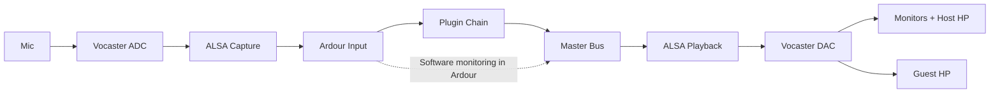

# SG9 Studio — Setup & Reference Manual

**Document Version:** 2.0 | **Last Updated:** 2026-01-19

This manual documents the SG9 Studio broadcast workflow using Ardour 8, the Focusrite Vocaster Two,
and FLOSS plugins. It standardizes on **software monitoring** in Ardour while the Vocaster provides
clean I/O and physical volume control.

## Quick Start (Daily)

- Power on the Vocaster Two and confirm your saved routing in `alsa-scarlett-gui`.
- Open Ardour and load the SG9 session/template.
- Monitor on **Guest headphones** (primary reference). Set comfortable levels with the hardware knobs.
- Arm what you need:
  - Track 1: Host Mic (processed)
  - Track 2: Host Mic (raw safety)
  - Track 5: Aux input (phone/tablet)
  - Track 7: Remote guest
- Pre-show checks (30–60 seconds):
  - No double monitoring (voice sounds clean, not phasey)
  - Remote echo check (guest does not hear themselves)
  - Loudness check: play 30 seconds and verify **-16 LUFS ±2 LU** and **TP ≤ -1.0 dBTP**

## Quick Start (First-Time Setup)

1. Configure hardware routing in [ALSA routing](#alsa-routing-vocaster--alsa-scarlett-gui).
2. Configure Ardour audio + monitoring in [Ardour session configuration](#ardour-session-configuration).
3. Apply the canonical chain in [Processing chains](#processing-chains).
4. Save a session template and verify loudness in [Loudness-lra--metering](#loudness-lra--metering).

## Signal Flow



## Hardware Overview

### Vocaster Two I/O

**Inputs**

- Host XLR (rear): primary mic
- Guest XLR (rear): optional guest mic
- Aux (front, 3.5 mm): phone/tablet
- Bluetooth: optional wireless audio
- USB: multichannel I/O to/from computer

**Outputs**

- Monitor L/R (rear TRS)
- Host headphones (front)
- Guest headphones (front, primary monitoring)

**Output topology**

- **Destination A:** Monitors + Host headphones (shared)
- **Destination B:** Guest headphones (independent)

## Monitoring Model (Software Monitoring)

SG9 Studio uses **software monitoring in Ardour**.

- Ardour controls **monitoring content** (what you hear).
- The Vocaster controls **physical loudness** only.
- Do **not** rely on the Vocaster mixer for monitoring content.

**Practical rule**: Set hardware knobs once for comfort, then mix entirely in Ardour.

## ALSA Routing (Vocaster + alsa-scarlett-gui)

**Goal:** Route raw inputs to Ardour and route Ardour’s master output to all destinations.

### Minimal routing map

| Source (Hardware) | → | Sink (USB to Ardour) | Purpose |
| --- | --- | --- | --- |
| Analogue 1 | → | PCM 01 | Host mic → Track 1 |
| Analogue 2 | → | PCM 05 | Guest mic → Track 2 |

| Source (USB from Ardour) | → | Sink (Hardware Output) | Purpose |
| --- | --- | --- | --- |
| PCM 01/02 | → | Analogue 1/2 | Monitors L/R |
| PCM 01/02 | → | Analogue 3/4 | Host HP L/R |
| PCM 01/02 | → | Analogue 5/6 | Guest HP L/R |

**Optional loopback for music capture**

| Source | → | Sink | Purpose |
| --- | --- | --- | --- |
| PCM 03/04 | → | PCM 03/04 | External audio → Ardour loopback track |

## Ardour Session Configuration

### Audio + Monitoring

- Audio System: ALSA
- Device: Vocaster Two
- Sample rate: 48 kHz
- Buffer: 128–256 samples (increase if needed)
- **Monitoring Model:** Software Monitoring
- **Auto Input:** Enabled

### Track I/O policy

- **Voice tracks:** Strict I/O (mono stays mono)
- **Stereo tracks:** Flexible I/O

### Suggested track list (minimal)

| # | Track | Type | Input | Monitor |
| ---: | --- | --- | --- | --- |
| 1 | Host Mic (DSP) | Mono | Capture 1 | Auto |
| 2 | Host Mic (Raw) | Mono | Capture 7 | Auto |
| 3 | Aux Input | Stereo | Capture 3–4 | Auto |
| 4 | Bluetooth | Stereo | Capture 5–6 | Auto |
| 5 | Remote Guest | Stereo | Capture 13–14 | Auto |
| 6 | Music Loopback | Stereo | Capture 11–12 | Disk |
| 7+ | Music/Jingles/SFX | Stereo | Files | Disk |

## Canonical Processing Order

**Order:** `HPF → Gate → De-esser (LSP SC) → EQ → Compressor → Limiter`

**Rationale:** HPF removes rumble before gate detection; de-esser before EQ prevents presence boosts
from amplifying sibilance.

## Processing Chains

### Host Mic (Primary)

| Stage | Plugin | Notes |
| --- | --- | --- |
| HPF | LSP EQ x8 | 80–100 Hz, 18 dB/oct |
| Gate | LSP Gate | Threshold -40 to -35 dB, enable **Hysteresis** |
| De-esser | **LSP Compressor (SC)** | SC HPF 5–7 kHz, 4:1 ratio |
| EQ | LSP EQ x8 | Presence +2–6 dB at 3–5 kHz |
| Compressor | LSP Compressor | 3–4:1 ratio, 10–20 ms attack |
| Limiter | LSP Limiter | Ceiling -1.0 dBTP, 4–8x oversampling |

**Gate hysteresis tip:** Set hysteresis threshold **6–10 dB below** the main threshold to avoid
chatter on quiet words.

### Host Mic (Raw Safety)

- Record a second mono track **without** processing.
- Use only for recovery or reprocessing.

### Remote Guest

| Stage | Plugin | Notes |
| --- | --- | --- |
| HPF | LSP EQ x8 | 150–200 Hz |
| Gate | LSP Gate | Stronger reduction (-30 to -40 dB) |
| De-esser | LSP Compressor (SC) | 6–8 kHz sidechain |
| EQ | LSP EQ x8 | Presence boost 2–3 kHz |
| Compressor | LSP Compressor | 6–8:1 ratio |
| Limiter | LSP Limiter | Ceiling -1.0 dBTP |

### Aux Input (Phone/Tablet)

- HPF 120–150 Hz
- Light gate
- Presence EQ (2–3 kHz)
- Heavy compression (6–8:1)
- Limiter

### Music Ducking

- Insert **Calf Sidechain Compressor** on Music Bus
- Sidechain: Voice Bus send
- Attack 10–20 ms, Release 300–500 ms, Ratio 4–6:1

### Master Bus

- Gentle glue compression (2–3:1)
- Limiter ceiling -1.0 dBTP
- Loudness and true-peak meters

## Controllers

### Korg nanoKONTROL Studio

- Use Ardour Generic MIDI with a custom binding file.
- Map VCA and bus faders for fast level control.

### Novation Launchpad Pro Mk2

- Use Programmer mode (Port 3).
- Map clip slots with MIDI Learn.
- Optional LED feedback via SysEx scripting.

## Loudness, LRA, & Metering

### Platform targets

| Platform | Integrated Loudness | True Peak Max | Notes |
| --- | --- | --- | --- |
| Apple Podcasts | -16 LUFS | -1.0 dBTP | Stereo target |
| Spotify | -14 LUFS | -1.0 dBTP | Normalized playback |
| YouTube | -14 LUFS | -1.0 dBTP | Loudness normalized |
| Amazon | -14 LUFS | -2.0 dBTP | More conservative TP |
| EBU R128 | -23 LUFS ±0.5 | -1.0 dBTP | Broadcast standard |

**Recommendation:** Produce at **-16 LUFS** for broadest compatibility, then derive other targets if needed.

### LRA targets

- Podcast: **4–10 LU**
- Broadcast: **5–15 LU**

If LRA is too low, ease compression. If too high, increase compression or tighten thresholds.

### Metering recommendations

- **Ardour Loudness Analyzer** (EBU R128)
- **x42-meter** for True Peak
- **Calf Analyzer** for spectrum + phase

## Redundancy Recording (Raw Safety)

Record a raw, unprocessed mono track in parallel with the processed chain.

- **Why:** Recovery from over-processing, clipping, or plugin issues.
- **Disk budget:** 48 kHz / 24-bit mono ≈ 8.2 MB per minute.
- **Recovery workflow:** Align the raw track, then reprocess with the canonical chain.

## Operational Workflows

### Solo recording

1. Arm Host Mic (DSP) and Host Mic (Raw).
2. Verify monitoring is from Ardour (no hardware mix).
3. Record.

### Remote interview

1. Arm Host Mic, Raw, and Remote Guest tracks.
2. Confirm mix-minus is generated in Ardour (no return in VoIP send).
3. Record.

### Aux guest

1. Plug device into Aux.
2. Arm Aux track.
3. Level match and record.

### Preflight validation

- Send test tone to Playback 1–2 and 3–4 to confirm destination mapping.
- Verify no echo on remote call (guest does not hear themselves).
- Play 30 seconds of content and verify **-16 LUFS ±2** and **TP ≤ -1.0 dBTP**.

## Troubleshooting

**Voice sounds phasey**

- Ensure hardware monitoring is off and Ardour is monitoring.

**Remote guest hears themselves**

- Remove return audio from the VoIP send bus.

**Levels feel inconsistent**

- Re-check gain staging: input peaks -18 to -12 dBFS pre-plugins.

**True Peak overs**

- Increase limiter oversampling and lower ceiling to -1.5 dBTP if needed.

## Appendices

### Appendix: Ardour Monitoring Technical Reference

**Monitoring model:** Software Monitoring (global).

**Auto Input (recommended):**

- Stopped + armed: input monitoring
- Rolling + not recording: disk monitoring
- Rolling + recording: input monitoring

**Per-track monitor mode:** Auto for all input tracks.

### Appendix: Plugin Technical Reference

**SG9 plugin stack:** LSP + Calf + ZAM + x42

**De-essing methods**

| Method | Status | Notes |
| --- | --- | --- |
| LSP Compressor (SC) | **SG9 Primary** | Professional, precise, transparent |
| Calf Deesser | Legacy/quick | Useful for fast setup |
| LSP Multiband | Advanced | Use for complex multi-band control |

**Installation (NixOS):**

```nix
environment.systemPackages = with pkgs; [
    ardour
    lsp-plugins
    calf
    zam-plugins
    x42-plugins
];
```

### Changelog

- **v2.0 (2026-01-19):** Consolidated documentation, standardized on software monitoring model,
  removed TAP plugins, updated de-essing hierarchy and canonical chain order.
