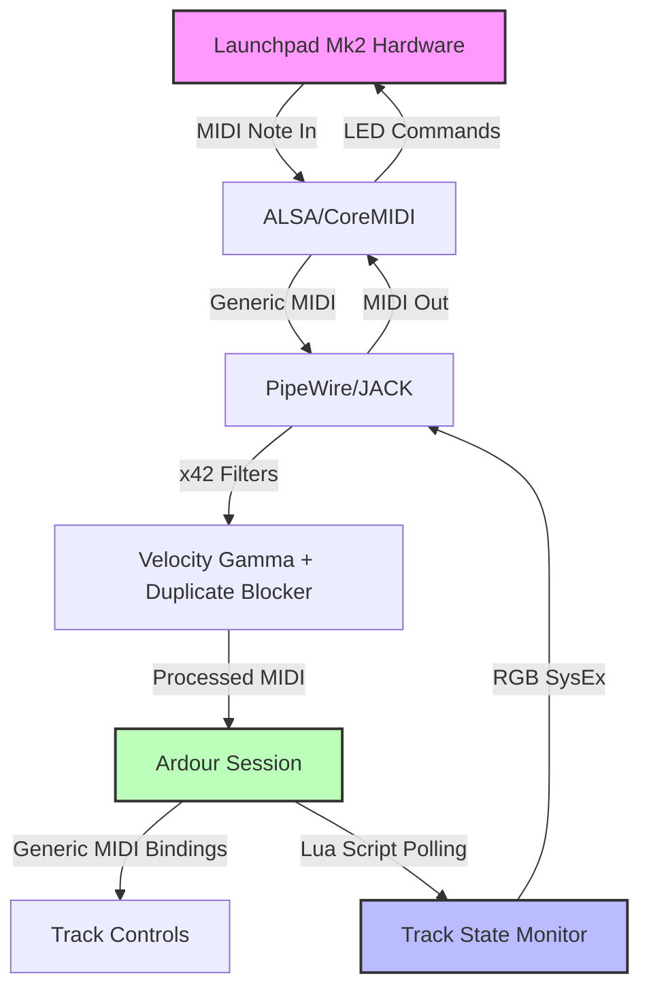

# SG9 Studio — MIDI Controller Integration Guide

**Document Version:** 2.0 | **Last Updated:** 2026-01-19

This guide provides comprehensive instructions for integrating and using MIDI control surfaces in SG9 Studio's Ardour 8 broadcast workflow. It covers the Korg nanoKONTROL Studio, Novation Launchpad Mk2 (with RGB LED feedback), and Novation Launchpad Pro (original version), from hardware setup through advanced mapping strategies and operational workflows.

## Table of Contents

- [Hardware Overview](#hardware-overview)
  - [Korg nanoKONTROL Studio](#korg-nanokontrol-studio)
  - [Novation Launchpad Mk2](#novation-launchpad-mk2)
  - [Novation Launchpad Pro (Original)](#novation-launchpad-pro-original)
- [Ardour Control Surface Architecture](#ardour-control-surface-architecture)
- [Hardware Setup & Connection](#hardware-setup--connection)
- [Ardour Configuration](#ardour-configuration)
- [Control Mappings](#control-mappings)
- [Launchpad Mk2 Integration](#launchpad-mk2-integration)
  - [Grid Layout & MIDI Protocol](#grid-layout--midi-protocol)
  - [RGB LED Feedback via Lua Scripts](#rgb-led-feedback-via-lua-scripts)
  - [Generic MIDI Bindings](#generic-midi-bindings)
  - [Error Recovery & Troubleshooting](#error-recovery--troubleshooting)
  - [Testing Workflow](#testing-workflow)
- [Advanced Mapping with x42 MIDI Tools](#advanced-mapping-with-x42-midi-tools)
- [Broadcast Workflow Recommendations](#broadcast-workflow-recommendations)
- [Troubleshooting](#troubleshooting)
- [Reference](#reference)

## Hardware Overview

### Korg nanoKONTROL Studio

**Purpose:** Primary DAW control for faders, transport, and track arming.

**Specifications:**

- **Controls:**
  - 8 sliders (100mm travel, **non-motorized**)
  - 8 rotary knobs (endless encoders)
  - 32 buttons (transport, solo, mute, rec, select)
  - 1 jog wheel
  - All controls have LED feedback
  
- **Connectivity:**
  - USB 2.0 (class compliant, no drivers needed on Linux)
  - Bluetooth LE MIDI (optional wireless)
  - Bus-powered via USB
  
- **MIDI Modes:**
  - **CC Mode:** Standard MIDI Control Change messages (default)
  - **Mackie Control Emulation:** Basic HUI/Mackie compatibility
  - Custom scenes (8 user-programmable layouts via KORG KONTROL Editor)

- **Dimensions:** 283 × 159 × 39 mm (compact, fits in front of Vocaster)

**Auto-Mapping Support:** Logic, GarageBand, Live, Cubase, Studio One, Pro Tools  
**Ardour Support:** Generic MIDI or Mackie Control protocol

---

### Novation Launchpad Mk2

**Purpose:** Visual track feedback with RGB LEDs, scene triggering, cue launching, and broadcast workflow automation via custom Lua scripts.

**Specifications:**

- **Controls:**
  - 64 velocity-sensitive RGB pads (8×8 grid)
  - 8 RGB top row buttons (transport control)
  - 8 RGB scene buttons (right column)
  - Total: 80 RGB LEDs with 128-color palette
  - Velocity-sensitive pads (127 levels)
  
- **Connectivity:**
  - USB 2.0 (class compliant, no drivers needed on Linux/macOS)
  - Bus-powered via USB
  - Standard MIDI note output (no DIN MIDI ports)
  
- **MIDI Modes:**
  - **Live Mode:** Optimized for Ableton Live integration (not used in SG9 Studio)
  - **Programmer Mode:** Raw MIDI note/CC output + RGB LED control via SysEx
  
- **Dimensions:** 230 × 230 × 18 mm (compact, portable)
- **Device ID:** 0x18 (SysEx header: `F0 00 20 29 02 18`)

**Ardour Support:** **Generic MIDI + custom Lua scripts** for RGB LED feedback  
**SG9 Integration:** Fully integrated via:
- **3 Lua EditorScripts** (`scripts/launchpad_mk2_*.lua`):
  - Real-time LED feedback (track arm/mute/solo/recording status)
  - Manual LED refresh action (desync recovery)
  - Brightness control (dim/medium/bright)
- **Generic MIDI binding map** (`~/.config/ardour8/midi_maps/sg9-launchpad-mk2.map`):
  - Transport control (play/stop/record/loop)
  - Track operations (arm/mute/solo for 8 tracks)
  - Cue triggers (Ardour 8.0+ cue grid)
  - Marker navigation and session management

**Key Features for Broadcast:**
- **Real-time visual feedback:** Track arm (red), recording (pulsing red), mute (orange), solo (yellow), ready (green)
- **Error recovery:** Automatic MIDI port reconnection, exponential backoff on failures
- **Adaptive polling:** 100ms during active recording, 500ms idle (CPU-efficient)
- **Session portability:** Brightness settings stored in session metadata
- **Hotplug support:** Auto-detects Launchpad connection/disconnection
- **Performance metrics:** Optional logging every 60s (LED updates, errors, uptime)

**Comparison to Launchpad Mk3:**
- **Mk2:** Requires custom Lua scripts for RGB feedback, no polyphonic aftertouch, 128-color palette
- **Mk3:** Native Ardour support, polyphonic aftertouch, larger color palette, more MIDI modes
- **SG9 Choice:** Mk2 sufficient for broadcast workflows (track feedback + transport), Mk3 unnecessary expense

---

### Novation Launchpad Pro (Original)

**Purpose:** Scene triggering, clip launching, visual feedback, custom control layouts via MIDI programming.

**Specifications:**

- **Controls:**
  - 64 velocity-sensitive RGB pads (8×8 grid)
  - 32 velocity-sensitive RGB buttons (function row, scene column)
  - Total: 96 RGB LEDs
  - Pressure-sensitive pads (not polyphonic aftertouch)
  
- **Connectivity:**
  - USB (Mini-B, class compliant)
  - MIDI In/Out (standard 5-pin DIN)
  - Bus-powered via USB
  - Standalone mode with built-in sequencer
  
- **MIDI Modes:**
  - **Live Mode:** Optimized for Ableton Live integration
  - **Standalone Sequencer:** 4-track, 32-step polyphonic sequencer  
  - **User Modes (4 slots):** Programmable via User mode button
  - **MIDI Mode:** Standard MIDI note/CC output for custom DAW mappings

- **Dimensions:** 268 × 268 × 33 mm

**Ardour Support:** **No native dedicated support**. Must use Generic MIDI protocol or Programmer mode for DAW control.

**Key Features for Broadcast:**
- Visual feedback with RGB pads (color-code tracks/buses)
- Scale mode for melodic input (not needed for broadcast, but useful for jingles)
- Velocity-sensitive pads for triggering samples/SFX
- Note mode for triggering clips (when Ardour Cue mode is active)

---

## Ardour Control Surface Architecture

Ardour 8 provides three approaches to MIDI controller integration:

### 1. Dedicated Control Surface Support

**Purpose:** Pre-configured, deep integration with specific hardware.

**Supported Devices (Ardour 8.x):**

| Device | Support Level | Features |
|--------|---------------|----------|
| Novation Launchpad Pro **Mk3** | Native | Clip triggering, track selection, RGB feedback, transport control |
| Mackie Control Universal | Full | Industry-standard DAW control protocol |
| Ableton Push 2 | Full | Pads, displays, encoders |
| PreSonus FaderPort 8/16 | Full | Motorized faders, scribble strips |

**Note:** The original Launchpad Pro (non-Mk3) does NOT have dedicated Ardour support. Use Generic MIDI instead.

**Advantages:**
- Plug-and-play: Auto-detection and configuration
- LED feedback automatically handled
- Context-aware controls (mixer view vs. editor view)

**Important:** The original Launchpad Pro does NOT have the dedicated control surface support that the Mk3 has. Ardour's "Launchpad Pro" control surface is specifically for the Mk3 model only.

---

### 2. Generic MIDI

**Purpose:** Map any MIDI controller to Ardour functions using CC, note, or sysex messages.

**Features:**
- MIDI Learn: Right-click any Ardour control → MIDI Learn → move controller
- Binding Maps (XML): Create persistent mappings saved as `.map` files
- Encoder support: Relative/absolute modes for rotary knobs

**nanoKONTROL Studio via Generic MIDI:**

**Pros:**
- Fine-grained control over every parameter
- Can map unconventional controls (e.g., jog wheel → scrub)
- Portable mappings (share `.map` files)

**Cons:**
- No motorized fader feedback (faders don't move with Ardour automation)
- Manual LED feedback mapping required
- One-to-one mapping only (no macros)

**Recommended Use:** When Mackie Control is too rigid or when mapping to specific plugin parameters.

---

### 3. Mackie Control Protocol

**Purpose:** Emulate industry-standard Mackie Control Universal (MCU) protocol.

**Features:**
- Motorized fader support
- Bank switching (8 channels at a time)
- Automatic LED feedback
- Transport control (play, stop, rec, etc.)

**nanoKONTROL Studio via Mackie Control:**

**Setup:**
1. Configure nanoKONTROL in "Control Mode" (via KORG KONTROL Editor)
2. Ardour: `Edit → Preferences → Control Surfaces → Mackie Control`
3. Set Device Type: "Mackie Control Universal"
4. Map input/output to nanoKONTROL ports

**Limitations:**
- nanoKONTROL is not a full MCU clone (missing display, some buttons)
- Bank-based workflow (8 tracks at a time)
- Less flexible than Generic MIDI for broadcast use cases

**Recommended Use:** For users familiar with MCU workflow from other DAWs.

---

### Comparison: Which Protocol to Use?

| Use Case | nanoKONTROL Studio | Launchpad Pro (Original) |
|----------|---------------------|---------------------------|
| **Fader control** | Generic MIDI (flexible) | N/A (pads only) |
| **Transport control** | Mackie Control or Generic MIDI | Generic MIDI |
| **Track arming** | Generic MIDI (custom mapping) | Generic MIDI |
| **Scene/clip triggering** | Not recommended | Generic MIDI (limited without native support) |
| **Plugin control** | Generic MIDI + x42 filters | Generic MIDI + User Modes |
| **Visual feedback** | Limited (LEDs via Generic MIDI) | RGB pads (custom programming required) |

**SG9 Recommendation:** Use **Generic MIDI** for both controllers. Launchpad Pro (original) requires manual programming for RGB feedback and custom layouts.

---

## Hardware Setup & Connection

### Korg nanoKONTROL Studio Setup

#### Physical Connection

1. Connect nanoKONTROL Studio to USB port (USB-A or USB-C)
2. Verify ALSA recognition:
   ```bash
   aconnect -l
   # Look for: "nanoKONTROL Studio" (client 20:0 or similar)
   ```
3. **Optional:** Configure Bluetooth MIDI (requires `bluez-utils`)
   - **Note:** USB is recommended for broadcast (lower latency, no dropouts)

#### Korg KONTROL Editor Configuration

**Install (NixOS):**

Download from [KORG website](https://www.korg.com/us/support/download/product/0/552/#software) (runs via Wine or macOS/Windows VM)

**Custom Scene Setup:**

Create a broadcast-optimized scene:

```
Scene 1: SG9 Broadcast
- Faders 1-8: Track volumes (CC 0-7)
- Knobs 1-8: Track pans (CC 16-23)
- Buttons Solo 1-8: Track solo (CC 32-39)
- Buttons Mute 1-8: Track mute (CC 48-55)
- Buttons Rec 1-8: Track arm (CC 64-71)
- Transport Play: Note On #41 (matches Ardour default)
- Transport Stop: Note On #42
- Transport Rec: Note On #44
- Jog Wheel: CC 60 (relative mode)
```

**Save to Scene Slot 1** and set as power-on default.

---

### Novation Launchpad Pro (Original) Setup

#### Physical Connection

1. Connect Launchpad Pro to USB port (Mini-B USB cable)
2. Verify ALSA recognition:
   ```bash
   aconnect -l
   # Look for: "Launchpad Pro" or "Launchpad Pro MIDI 1" (single MIDI port)
   ```
3. **Note:** Use the single MIDI port for Ardour integration

#### User Mode Programming

**Accessing User Modes:**

1. Press **User** button (top row, 4th from left)
2. Launchpad enters User mode (pads send standard MIDI notes)
3. 4 user modes available (User button cycles through them)

**Programming via SysEx (advanced):**

- Download Launchpad Pro Programmer's Reference from Novation
- Use SysEx messages to set pad colors and behaviors
- **Use Case:** Custom layouts for SFX triggering, transport control, track selection

#### Custom Programming

**Novation Components (web-based editor):**

- **Purpose:** Program User modes with custom MIDI mappings
- **Access:** [components.novationmusic.com](https://components.novationmusic.com)
- **Use for:** Creating transport buttons, track selection pads, SFX triggers
- **Limitation:** Does NOT provide the same deep integration as Launchpad Pro Mk3's native Ardour support

---

## Ardour Configuration

### Enable Control Surfaces

#### Launchpad Pro (Generic MIDI)

**Since the original Launchpad Pro does NOT have dedicated Ardour support, configure as Generic MIDI:**

1. `Edit → Preferences → Control Surfaces`
2. Check **☑ Enable** next to "Generic MIDI"
3. Click **Show Protocol Settings**
4. Configure ports:
   - **Incoming MIDI:** "Launchpad Pro MIDI 1"
   - **Outgoing MIDI:** "Launchpad Pro MIDI 1"
5. **Binding Map:** None (manual programming required)
6. Click **OK**

**RGB Feedback:** Not automatic. Requires manual SysEx programming to update pad colors.

**Verification:**

- Press pads in User mode → Ardour receives MIDI notes
- Use MIDI Learn to bind pads to Ardour functions (transport, track selection, etc.)

---

#### nanoKONTROL Studio (Generic MIDI)

1. `Edit → Preferences → Control Surfaces`
2. Check **☑ Enable** next to "Generic MIDI"
3. Click **Show Protocol Settings**
4. Configure ports:
   - **Incoming MIDI:** "nanoKONTROL Studio MIDI 1"
   - **Outgoing MIDI:** "nanoKONTROL Studio MIDI 1"
5. **Binding Map:** None (we'll create custom)
6. **Motorized:** Off (nanoKONTROL has sliders, not motorized faders)
7. Click **OK**

**Create Binding Map:**

1. Right-click Ardour Master fader → **MIDI Learn**
2. Move nanoKONTROL Fader 1
3. Ardour creates binding automatically
4. Repeat for all desired controls
5. Save: `Session → Export → Export MIDI Bindings...`
   - Save as: `~/.config/ardour8/midi_maps/sg9-nanokontrol.map`

**Alternative:** Manually create `.map` file (see [Control Mappings](#control-mappings) section).

---

### MIDI Routing in Ardour

**Verify PipeWire/JACK connections:**

```bash
pw-link -l | grep -i korg
pw-link -l | grep -i launchpad
```

**Expected output:**

```
nanoKONTROL Studio:midi_playback_1 → Ardour:MIDI Control In
Ardour:MIDI Control Out → nanoKONTROL Studio:midi_capture_1
Launchpad Pro:midi_playback_1 → Ardour:MIDI Control In
Ardour:MIDI Control Out → Launchpad Pro:midi_capture_1
```

**If missing:** Use `qpwgraph` (GUI) or `pw-link` (CLI) to manually connect.

---

## Control Mappings

### nanoKONTROL Studio: SG9 Broadcast Mapping

**File:** `~/.config/ardour8/midi_maps/sg9-nanokontrol.map`

```xml
<?xml version="1.0" encoding="UTF-8"?>
<ArdourMIDIBindings version="1.0.0" name="SG9 nanoKONTROL Studio">

  <!-- Transport Controls -->
  <Binding channel="1" note="41" function="transport-start"/>
  <Binding channel="1" note="42" function="transport-stop"/>
  <Binding channel="1" note="44" function="toggle-rec-enable"/>
  <Binding channel="1" note="45" function="loop-toggle"/>
  
  <!-- Track 1: Host Mic (DSP) -->
  <Binding channel="1" ctl="0" uri="/route/gain B1"/>
  <Binding channel="1" ctl="16" uri="/route/pandirection B1"/>
  <Binding channel="1" ctl="32" uri="/route/solo B1"/>
  <Binding channel="1" ctl="48" uri="/route/mute B1"/>
  <Binding channel="1" ctl="64" uri="/route/recenable B1"/>
  
  <!-- Track 2: Host Mic (Raw) -->
  <Binding channel="1" ctl="1" uri="/route/gain B2"/>
  <Binding channel="1" ctl="17" uri="/route/pandirection B2"/>
  <Binding channel="1" ctl="33" uri="/route/solo B2"/>
  <Binding channel="1" ctl="49" uri="/route/mute B2"/>
  <Binding channel="1" ctl="65" uri="/route/recenable B2"/>
  
  <!-- Track 3: Guest Mic -->
  <Binding channel="1" ctl="2" uri="/route/gain B3"/>
  <Binding channel="1" ctl="18" uri="/route/pandirection B3"/>
  <Binding channel="1" ctl="34" uri="/route/solo B3"/>
  <Binding channel="1" ctl="50" uri="/route/mute B3"/>
  <Binding channel="1" ctl="66" uri="/route/recenable B3"/>
  
  <!-- Track 4: Aux Input -->
  <Binding channel="1" ctl="3" uri="/route/gain B4"/>
  <Binding channel="1" ctl="19" uri="/route/pandirection B4"/>
  <Binding channel="1" ctl="35" uri="/route/solo B4"/>
  <Binding channel="1" ctl="51" uri="/route/mute B4"/>
  <Binding channel="1" ctl="67" uri="/route/recenable B4"/>
  
  <!-- Track 5: Bluetooth -->
  <Binding channel="1" ctl="4" uri="/route/gain B5"/>
  <Binding channel="1" ctl="20" uri="/route/pandirection B5"/>
  <Binding channel="1" ctl="36" uri="/route/solo B5"/>
  <Binding channel="1" ctl="52" uri="/route/mute B5"/>
  <Binding channel="1" ctl="68" uri="/route/recenable B5"/>
  
  <!-- Track 6: Remote Guest -->
  <Binding channel="1" ctl="5" uri="/route/gain B6"/>
  <Binding channel="1" ctl="21" uri="/route/pandirection B6"/>
  <Binding channel="1" ctl="37" uri="/route/solo B6"/>
  <Binding channel="1" ctl="53" uri="/route/mute B6"/>
  <Binding channel="1" ctl="69" uri="/route/recenable B6"/>
  
  <!-- Track 7: Music 1 -->
  <Binding channel="1" ctl="6" uri="/route/gain B7"/>
  <Binding channel="1" ctl="22" uri="/route/pandirection B7"/>
  <Binding channel="1" ctl="38" uri="/route/solo B7"/>
  <Binding channel="1" ctl="54" uri="/route/mute B7"/>
  <Binding channel="1" ctl="70" uri="/route/recenable B7"/>
  
  <!-- Track 8: Music 2 -->
  <Binding channel="1" ctl="7" uri="/route/gain B8"/>
  <Binding channel="1" ctl="23" uri="/route/pandirection B8"/>
  <Binding channel="1" ctl="39" uri="/route/solo B8"/>
  <Binding channel="1" ctl="55" uri="/route/mute B8"/>
  <Binding channel="1" ctl="71" uri="/route/recenable B8"/>
  
  <!-- Jog Wheel → Scrub/Shuttle -->
  <Binding channel="1" ctl="60" function="shuttle"/>
  
</ArdourMIDIBindings>
```

**Usage:**

1. Save to `~/.config/ardour8/midi_maps/sg9-nanokontrol.map`
2. Ardour → `Edit → Preferences → Control Surfaces → Generic MIDI → Show Protocol Settings`
3. **Binding File:** Browse to `sg9-nanokontrol.map`
4. Click **OK** → reload session

**Note:** `/route/gain B1` means "Bus 1 (track 1) gain control". Adjust `B#` numbers to match your track order.

---

### Launchpad Pro (Original): SG9 Custom Layout (Manual Programming)

**Without native Ardour support, you must manually program the Launchpad using SysEx messages or MIDI Learn:**

**Recommended Layout (User Mode 1):**

- **Row 8 (top):** Transport controls (Play, Stop, Rec, Metronome, etc.)
- **Row 7:** Track selection (pads 1-8 select tracks 1-8)
- **Row 6:** Track arming (pads arm/disarm corresponding tracks)
- **Row 5:** Mute (pads mute/unmute tracks)
- **Row 4:** Solo (pads solo tracks)
- **Rows 3-1:** SFX/Jingle triggers (bind to MIDI clips in Ardour)

**RGB Feedback Programming:**

Launchpad Pro (original) requires SysEx messages to control RGB LEDs:

```python
# Example: Set pad (note 36) to red (color 5)
SysEx: F0 00 20 29 02 10 0A 24 05 F7
# F0 00 20 29 02 10 = Launchpad Pro header
# 0A = Set LED command (type 1)
# 24 = Note 36 (hex)
# 05 = Red color
# F7 = End SysEx
```

**Color Palette:**

| Color | Code | Use Case |
|-------|------|----------|
| Red | 5 | Recording, armed tracks |
| Orange | 9 | Active tracks |
| Yellow | 13 | Warnings |
| Green | 21 | Playback, ready |
| Blue | 45 | Music tracks |
| Purple | 53 | SFX triggers |

---

## Launchpad Mk2 Integration

This section details the complete Launchpad Mk2 integration for SG9 Studio, including the custom Lua script implementation for RGB LED feedback, Generic MIDI bindings, and operational workflows.

### Architecture Overview

The Launchpad Mk2 integration uses a **hybrid approach**:

1. **Lua EditorScripts** (running inside Ardour's GUI thread):
   - Real-time RGB LED feedback based on track state
   - Manual LED refresh action (desync recovery)
   - Brightness control with session metadata persistence

2. **Generic MIDI Bindings** (XML map file):
   - Transport control (play/stop/record/loop)
   - Track operations (arm/mute/solo)
   - Cue triggers (Ardour 8.0+ cue grid)
   - Marker navigation

3. **x42 MIDI Filters** (optional, LV2 plugins):
   - Velocity curve adjustment (softer pads via gamma=2.0)
   - Duplicate blocker (200ms debounce for bouncy pads)
   - Event filter (remove unwanted MIDI messages)

**Why This Approach?**

- **Session portability:** Lua scripts embedded in Ardour session, no external dependencies
- **Cross-platform:** Works on Linux and macOS (PipeWire, JACK, or CoreMIDI)
- **Robust:** Automatic error recovery, hotplug detection, adaptive polling
- **Lightweight:** Minimal CPU usage (~0.5% typical, adaptive 100ms/500ms polling)



---

### Grid Layout & MIDI Protocol

#### Physical Layout

```
┌─────────────────────────────────────────────────┬───────┐
│ Top Row (Transport)                             │ Scene │
│ 104  105  106  107  108  109  110  111          │  89   │
│ Play Stop Rec  Loop Rew  FFwd Home End          │       │
├─────────────────────────────────────────────────┼───────┤
│ Row 1 (Track Arm - automated RGB feedback)      │       │
│  81   82   83   84   85   86   87   88          │  79   │
│  B1   B2   B3   B4   B5   B6   B7   B8          │ Save  │
├─────────────────────────────────────────────────┼───────┤
│ Row 2 (Mute)                                    │       │
│  71   72   73   74   75   76   77   78          │  69   │
│  B1   B2   B3   B4   B5   B6   B7   B8          │ Undo  │
├─────────────────────────────────────────────────┼───────┤
│ Row 3 (Solo)                                    │       │
│  61   62   63   64   65   66   67   68          │  59   │
│  B1   B2   B3   B4   B5   B6   B7   B8          │ Redo  │
├─────────────────────────────────────────────────┼───────┤
│ Row 4 (Cue Triggers A1-A8)                      │       │
│  51   52   53   54   55   56   57   58          │  49   │
│  B1   B2   B3   B4   B5   B6   B7   B8          │ Cue A │
├─────────────────────────────────────────────────┼───────┤
│ Row 5 (Cue Triggers B1-B8)                      │       │
│  41   42   43   44   45   46   47   48          │  39   │
│  B1   B2   B3   B4   B5   B6   B7   B8          │ Cue B │
├─────────────────────────────────────────────────┼───────┤
│ Row 6 (Cue Triggers C1-C8)                      │       │
│  31   32   33   34   35   36   37   38          │  29   │
│  B1   B2   B3   B4   B5   B6   B7   B8          │ Cue C │
├─────────────────────────────────────────────────┼───────┤
│ Row 7 (Mixer View Navigation)                   │       │
│  21   22   23   24   25   26   27   28          │  19   │
│ Bank◄ Bank► Sel◄ Sel► Vol  Pan  Send Plug      │ Mix   │
├─────────────────────────────────────────────────┼───────┤
│ Row 8 (Markers)                                 │       │
│  11   12   13   14   15   16   17   18          │   9   │
│ Add  Prev Next Del  JmpL JmpR Loop Punch        │ Mark  │
└─────────────────────────────────────────────────┴───────┘
```

**Note Number Ranges:**

- **Grid Pads:** 11-88 (8 rows × 8 columns, skip row 0)
- **Scene Column (right):** 89, 79, 69, 59, 49, 39, 29, 19, 9
- **Top Row:** 104-111
- **Total:** 80 RGB LEDs

#### MIDI Protocol (Programmer Mode)

**SysEx Header:**

```
F0 00 20 29 02 18  # Device ID: 0x18 (Launchpad Mk2)
```

**Set LED Color (Solid):**

```
F0 00 20 29 02 18 0A <note> <color> F7
# Example: Set pad 81 to red (5)
F0 00 20 29 02 18 0A 51 05 F7
```

**Set LED Color (Pulse):**

```
F0 00 20 29 02 18 23 <note> <color> F7
# Example: Pulse pad 81 red (recording indicator)
F0 00 20 29 02 18 23 51 05 F7
```

**Set Global Brightness:**

```
F0 00 20 29 02 18 08 <brightness> F7
# Brightness: 0-127 (SG9 uses 32/64/127 for dim/medium/bright)
```

**Color Palette (128 colors, SG9 Studio subset):**

| Color | Code | SG9 Use Case |
|-------|------|--------------|
| Off | 0 | Inactive/ready pads |
| Red | 5 | Armed tracks, recording (pulse mode) |
| Orange | 9 | Muted tracks |
| Yellow | 13 | Soloed tracks |
| Green | 21 | Ready/idle tracks |
| Blue | 45 | (Reserved for future use) |
| Purple | 53 | (Reserved for future use) |
| White | 3 | (Reserved for future use) |

**Full palette:** See Novation Launchpad Mk2 Programmer's Reference Manual (128-color table).

---

### RGB LED Feedback via Lua Scripts

The SG9 Studio integration uses three Lua EditorScripts for RGB LED control:

#### 1. `launchpad_mk2_feedback.lua` (Main Real-Time Feedback)

**Type:** EditorHook (runs continuously in GUI thread)  
**Location:** `scripts/launchpad_mk2_feedback.lua`

**Features:**

- **Adaptive polling:**
  - 100ms interval during active recording (responsive feedback)
  - 500ms interval when idle (CPU-efficient)
  
- **Track state monitoring (8 tracks):**
  - Armed: Solid red LED
  - Recording: Pulsing red LED (via SysEx pulse command)
  - Muted: Orange LED
  - Soloed: Yellow LED
  - Ready/idle: Green LED
  - Inactive: LED off
  
- **Error recovery:**
  - 3-retry exponential backoff on SysEx send failures
  - Automatic timeline marker creation on persistent errors
  - Auto-removal of error markers when connection restores
  - Hotplug detection every 5 seconds
  
- **Performance optimizations:**
  - State caching (only update LEDs when track state changes)
  - Rate limiting (max 50 SysEx messages per second)
  - Batch LED updates during bank switches
  
- **Logging:**
  - INFO: Port detection, reconnection events
  - WARN: Retry attempts, recoverable errors
  - ERROR: Persistent failures, port unavailable
  - Metrics: LED update count, error count, uptime (every 60s, optional)

**Installation:**

1. Copy `scripts/launchpad_mk2_feedback.lua` to Ardour session directory or global scripts folder
2. Ardour: `Edit → Preferences → Scripting → Manage Scripts`
3. Add script: `launchpad_mk2_feedback.lua`
4. Enable: Check "Active" box
5. Script will auto-start on session load

**How It Works:**

1. On startup, script searches for Launchpad Mk2 MIDI port (regex pattern matching)
2. Subscribes to Ardour signals:
   - `LuaSignal.LuaTimerDS` (periodic timer, adaptive 100ms/500ms)
   - `Session:RecordArmStateChanged` (track arm/disarm)
   - `Session:SoloActive` (solo changes)
3. Every poll interval:
   - Queries 8 tracks (B1-B8) for rec_enable, mute, solo, recording state
   - Compares to cached state
   - Sends SysEx LED updates for changed pads only
4. On error (send failure, port disconnect):
   - Retries with exponential backoff (100ms, 200ms, 400ms)
   - Creates timeline marker if all retries fail
   - Attempts port reconnection every 5 seconds

**Configuration (edit script constants):**

```lua
CONFIG = {
  poll_interval_active = 100,  -- ms (during recording)
  poll_interval_idle = 500,    -- ms (when idle)
  max_retries = 3,
  rate_limit_per_sec = 50,
  hotplug_check_interval = 5000, -- ms
  log_metrics_interval = 60000,  -- ms (0 to disable)
}
```

#### 2. `launchpad_mk2_refresh_leds.lua` (Manual Refresh Action)

**Type:** EditorAction (user-triggered)  
**Location:** `scripts/launchpad_mk2_refresh_leds.lua`

**Purpose:** Manually resync all 80 LEDs when desync occurs (e.g., after Launchpad hardware reset, external MIDI interference).

**Usage:**

1. Ardour: `Edit → Lua Scripts → Launchpad Mk2: Refresh All LEDs`
2. Script will:
   - Find Launchpad Mk2 port
   - Query current session state (all tracks, transport)
   - Send SysEx for all 80 LEDs (grid + top row + scene column)
   - Log completion: `INFO: Refresh completed: 80 LEDs updated`

**When to Use:**

- LEDs stuck in wrong color after Launchpad power cycle
- After MIDI port reconnection
- After Ardour session snapshot load (if LEDs don't update)
- Manual verification during troubleshooting

**Note:** The main feedback script handles most desync cases automatically via hotplug detection and error recovery. This action is for manual intervention only.

#### 3. `launchpad_mk2_brightness.lua` (Brightness Cycle Action)

**Type:** EditorAction (user-triggered)  
**Location:** `scripts/launchpad_mk2_brightness.lua`

**Purpose:** Cycle global Launchpad Mk2 brightness: Dim → Medium → Bright → Dim

**Brightness Levels:**

| Level | Value | Percentage | Use Case |
|-------|-------|------------|----------|
| Dim | 32/127 | ~25% | Low-light environments, late-night sessions |
| Medium | 64/127 | ~50% | Default, balanced visibility |
| Bright | 127/127 | 100% | Bright studios, daytime use |

**Usage:**

1. Ardour: `Edit → Lua Scripts → Launchpad Mk2: Cycle Brightness`
2. Current brightness stored in **session metadata** (persists across saves)
3. Script cycles to next level and updates Launchpad via SysEx cmd `0x08`
4. Log output: `INFO: Brightness changed: medium → bright (127/127)`

**Session Metadata Key:** `launchpad_mk2_brightness`

**Why Session Metadata?**

- Brightness preference is session-specific (bright for live shows, dim for editing)
- Automatically restored on session load
- No external config files needed

---

### Generic MIDI Bindings

**File:** `~/.config/ardour8/midi_maps/sg9-launchpad-mk2.map`

**Installation:**

1. Copy `sg9-launchpad-mk2.map` to `~/.config/ardour8/midi_maps/`
2. Ardour: `Edit → Preferences → Control Surfaces`
3. Enable **Generic MIDI**
4. Click **Show Protocol Settings**
5. Select **Incoming MIDI:** `Launchpad Mk2:Launchpad Mk2 MIDI 1`
6. Select **Outgoing MIDI:** `Launchpad Mk2:Launchpad Mk2 MIDI 1`
7. Click **MIDI Binding File:** Browse to `sg9-launchpad-mk2.map`
8. Restart Ardour

**Binding Overview:**

| Grid Section | Function | Ardour Binding |
|--------------|----------|----------------|
| **Top Row (104-111)** | Transport Control | Play, Stop, Rec, Loop, Rewind, FFwd, Home, End |
| **Row 1 (81-88)** | Track Arm (B1-B8) | `rec-enable` via `/route/B1` - `/route/B8` |
| **Row 2 (71-78)** | Track Mute (B1-B8) | `mute` via `/route/B1` - `/route/B8` |
| **Row 3 (61-68)** | Track Solo (B1-B8) | `solo` via `/route/B1` - `/route/B8` |
| **Row 4-6 (51-31)** | Cue Triggers A-C (8 each) | `trigger-cue` via `/cues/A/1` - `/cues/C/8` |
| **Row 7 (21-28)** | Mixer Navigation | Bank◄/►, Select◄/►, View toggles |
| **Row 8 (11-18)** | Marker Management | Add, Prev/Next, Delete, Loop/Punch |
| **Scene Column (89-9)** | Session Operations | Save, Undo/Redo, View toggles |

**Track URI Naming:**

The bindings use `/route/B1` - `/route/B8` to match SG9 Studio's 8-track broadcast template naming convention:

- B1: Host Mic (DSP chain)
- B2: Host Mic (Raw safety)
- B3: Guest Mic (optional)
- B4: (Reserved)
- B5: Aux Input (phone/tablet)
- B6: (Reserved)
- B7: Remote Guest (VoIP)
- B8: Music/Bed track

**Note:** If your track names differ, edit the `.map` file and replace `/route/B1` with your track names (e.g., `/route/Host Mic`).

**Cue Triggers (Ardour 8.0+):**

Requires Ardour 8.0 or later with Cue Grid feature enabled:

1. `Window → Show Cues`
2. Load audio clips into cue grid slots
3. Launchpad pads (rows 4-6) trigger corresponding cue slots
4. Useful for jingles, sound effects, intro/outro music

If you don't use cues, these pads can be reassigned (edit `.map` file).

**Customization Example (change row 4 to plugin bypass):**

```xml
<!-- Original (cue trigger) -->
<Binding channel="1" note="51" function="trigger-cue" uri="/cues/A/1"/>

<!-- Modified (bypass Host Mic compressor) -->
<Binding channel="1" note="51" function="plugin-bypass" uri="/route/B1/plugin/Compressor"/>
```

See Ardour Generic MIDI documentation for full function list:  
https://manual.ardour.org/using-control-surfaces/generic-midi/midi-binding-maps/

---

### Error Recovery & Troubleshooting

#### Automatic Error Recovery

The main feedback script (`launchpad_mk2_feedback.lua`) includes robust error handling:

**Scenario 1: Launchpad Disconnected During Session**

1. Script detects SysEx send failure
2. Retries 3× with exponential backoff (100ms, 200ms, 400ms)
3. If all retries fail:
   - Creates timeline marker: `MIDI Error: Launchpad Mk2 disconnected`
   - Logs error: `ERROR: Failed to send SysEx after 3 retries`
4. Every 5 seconds, attempts port reconnection
5. When reconnected:
   - Removes error marker automatically
   - Logs: `INFO: Launchpad Mk2 reconnected`
   - Resumes LED updates

**User Action:** None required. Reconnect Launchpad USB cable, script auto-recovers.

**Scenario 2: LED Desync (Wrong Colors)**

**Causes:**

- External MIDI software sending LED commands to Launchpad
- Launchpad hardware reset (power cycle)
- MIDI port conflict (multiple applications accessing same port)

**Manual Fix:**

1. Ardour: `Edit → Lua Scripts → Launchpad Mk2: Refresh All LEDs`
2. Verify all 80 LEDs match current track state

**Automatic Fix (in main script):**

- Hotplug detection triggers full LED refresh on reconnection
- State cache prevents redundant updates

**Scenario 3: High CPU Usage**

**Symptoms:** Ardour GUI lag, high CPU on Lua script

**Diagnosis:**

1. Check metrics log (if enabled):
   ```
   [Launchpad Mk2 Feedback] [INFO] Metrics: 360 LED updates, 0 errors, 60s uptime
   ```
2. High LED update count (>1000/min) indicates excessive state changes

**Fixes:**

- Increase `poll_interval_active` to 200ms (edit script)
- Disable metrics logging (set `log_metrics_interval = 0`)
- Reduce track count monitored (edit `CONFIG.track_count = 4`)

**Typical CPU usage:** <0.5% on modern systems (adaptive 100ms/500ms polling)

#### Common Issues

**Issue:** Launchpad LEDs don't update

**Checklist:**

1. Verify Launchpad in **Programmer Mode** (not Live Mode)
   - Press "Setup" → Use mode button to switch modes
2. Verify MIDI ports connected in Generic MIDI settings
   - `Edit → Preferences → Control Surfaces → Generic MIDI → Show Protocol Settings`
   - Incoming/Outgoing should show `Launchpad Mk2:Launchpad Mk2 MIDI 1`
3. Verify Lua script enabled:
   - `Edit → Preferences → Scripting → Manage Scripts`
   - Check "Active" box next to `launchpad_mk2_feedback.lua`
4. Check Ardour log for errors:
   - `Window → Audio/MIDI Setup → Log → Scroll to recent entries`
   - Look for: `[Launchpad Mk2 Feedback] [ERROR]`
5. Manual refresh: `Edit → Lua Scripts → Launchpad Mk2: Refresh All LEDs`

**Issue:** Pads trigger multiple times (bouncy pads)

**Solution:** Use x42 MIDI Duplicate Blocker

1. Add MIDI track above Launchpad input
2. Insert plugin: `x42 MIDI Duplicate Blocker`
3. Set debounce time: `200ms`
4. Route: Launchpad → Duplicate Blocker → Generic MIDI

**Issue:** Pads too sensitive (hard to control)

**Solution:** Use x42 MIDI Velocity Gamma

1. Add MIDI track above Launchpad input
2. Insert plugin: `x42 MIDI Velocity Gamma`
3. Set gamma: `2.0` (makes pads feel softer)
4. Route: Launchpad → Velocity Gamma → Duplicate Blocker → Generic MIDI

**Issue:** Brightness resets to default on session load

**Diagnosis:** Session metadata not saved

**Fix:**

1. After changing brightness, save session: `Session → Save`
2. Verify metadata stored:
   ```bash
   grep "launchpad_mk2_brightness" ~/.config/ardour8/sessions/YourSession/YourSession.ardour
   ```
   Should show: `<Metadata name="launchpad_mk2_brightness" value="bright"/>`

**Issue:** Script crashes Ardour on startup

**Diagnosis:** Lua syntax error or API incompatibility

**Fix:**

1. Check luacheck output:
   ```bash
   luacheck scripts/launchpad_mk2_feedback.lua
   ```
2. Verify Ardour version ≥ 8.0:
   ```bash
   ardour8 --version
   ```
3. Disable script temporarily:
   - `Edit → Preferences → Scripting → Manage Scripts → Uncheck "Active"`
4. Report issue with Ardour log excerpts

---

### Testing Workflow

#### Development Testing (No Hardware)

**Option 1: Virtual MIDI Loopback (Linux)**

```bash
# Load virtual MIDI kernel module
sudo modprobe snd-virmidi

# Verify virtual ports
aconnect -l
# Should show: Virtual Raw MIDI (client 20:0 or similar)

# In Ardour Generic MIDI settings:
# - Incoming: Virtual Raw MIDI 1
# - Outgoing: Virtual Raw MIDI 1

# Monitor SysEx output
aseqdump -p "Virtual Raw MIDI 1"
```

**Option 2: IAC Driver (macOS)**

1. Open **Audio MIDI Setup** (`/Applications/Utilities/`)
2. Window → Show MIDI Studio
3. Double-click **IAC Driver**
4. Check "Device is online"
5. Add port: "Launchpad Mk2 Virtual"
6. In Ardour Generic MIDI settings:
   - Incoming: IAC Driver - Launchpad Mk2 Virtual
   - Outgoing: IAC Driver - Launchpad Mk2 Virtual

**Option 3: Lua CLI Testing with `luasession`**

**Availability:** Requires Ardour 8.0+ compiled with `luasession` support  
**NixOS Note:** Not available in `nixpkgs.ardour` (Ardour must be installed manually)

**Workflow:**

```bash
# Syntax check (no Ardour required)
luacheck scripts/launchpad_mk2_feedback.lua

# Load script in Ardour CLI session (requires Ardour install)
luasession -s /path/to/session.ardour -c "
  dofile('scripts/launchpad_mk2_feedback.lua')
  -- Trigger factory() manually
  local callback = factory()
  callback()
"
```

**Limitations:**

- `luasession` doesn't provide GUI signals (LuaTimerDS unavailable in headless mode)
- EditorHook scripts require full Ardour GUI
- Best for syntax checking and SysEx generation testing only

#### Hardware Testing

**Step 1: Connect Launchpad Mk2**

```bash
# Verify USB connection
lsusb | grep Novation
# Should show: Bus 001 Device 005: ID 1235:0069 Focusrite-Novation Launchpad MK2

# Verify ALSA MIDI
aconnect -l | grep Launchpad
# Should show: Launchpad MK2 (client 20:0 or similar)
```

**Step 2: Test MIDI Input (Pads → Ardour)**

1. Ardour: `Window → Audio/MIDI Setup → MIDI tab`
2. Enable: `Launchpad MK2 MIDI 1` (input)
3. Create MIDI track
4. Set input: `Launchpad MK2 MIDI 1 / capture_1`
5. Arm track, press pad
6. Should see MIDI notes in track (notes 11-111)

**Step 3: Test SysEx Output (Ardour → LEDs)**

1. Add MIDI track
2. Create empty region
3. Open MIDI editor (double-click region)
4. Draw SysEx event (Edit → Insert SysEx):
   ```
   F0 00 20 29 02 18 0A 51 05 F7
   # Sets pad 81 (note 81, hex 0x51) to red (5)
   ```
5. Set track output: `Launchpad MK2 MIDI 1 / playback_1`
6. Play region
7. Pad 81 (top-left of grid) should light red

**Step 4: Test Lua Script**

1. Copy `scripts/launchpad_mk2_feedback.lua` to session scripts folder
2. `Edit → Preferences → Scripting → Manage Scripts → Add`
3. Select script, check "Active"
4. Observe log:
   ```
   [Launchpad Mk2 Feedback] [INFO] Found Launchpad Mk2 port: Launchpad MK2 MIDI 1
   ```
5. Arm track B1
6. Pad 81 should light solid red
7. Start recording
8. Pad 81 should pulse red
9. Stop recording
10. Pad 81 should return to solid red

**Step 5: Test Generic MIDI Bindings**

1. Install `sg9-launchpad-mk2.map` (see Generic MIDI Bindings section)
2. Enable Generic MIDI with map file
3. Test transport controls:
   - Pad 104 (top row, left): Play/pause (should toggle transport)
   - Pad 105: Stop
   - Pad 106: Record arm
4. Test track arm (row 1):
   - Pad 81: Arm track B1 (should match Lua script LED feedback)

#### Automated Testing (CI/CD)

**Syntax Validation (GitHub Actions example):**

```yaml
name: Validate Lua Scripts
on: [push, pull_request]
jobs:
  luacheck:
    runs-on: ubuntu-latest
    steps:
      - uses: actions/checkout@v4
      - uses: cachix/install-nix-action@v24
      - run: nix develop --command luacheck scripts/*.lua
```

**XML Map Validation:**

```bash
xmllint --noout --schema /usr/share/ardour8/midi_maps/midi_map.xsd ~/.config/ardour8/midi_maps/sg9-launchpad-mk2.map
```

---

## Advanced Mapping with x42 MIDI Tools

**Purpose:** Transform, filter, or route MIDI messages for complex control scenarios not achievable with Generic MIDI alone.

### x42 MIDI Filter Collection

**Installation (NixOS):**

```nix
environment.systemPackages = with pkgs; [
  x42-plugins  # Includes full MIDI filter collection
];
```

**Plugins (32+ filters available):**

| Plugin | Use Case for SG9 Studio |
|--------|-------------------------|
| **MIDI Channel Filter** | Separate nanoKONTROL scenes to different Ardour tracks |
| **MIDI CC Map** | Remap CC numbers (e.g., nanoKONTROL knobs → plugin params) |
| **MIDI Note Transpose** | Shift Launchpad pads to different octaves for SFX triggering |
| **MIDI Velocity Adjust** | Normalize pad velocity for consistent triggering |
| **MIDI Duplicate Blocker** | Prevent double-triggers from worn buttons |
| **MIDI Event Filter** | Block unwanted messages (e.g., aftertouch if not needed) |
| **MIDI Delay** | Compensate for controller latency |

---

### Example 1: Remap nanoKONTROL Knobs to Plugin Parameters

**Scenario:** Use nanoKONTROL knobs to control LSP Compressor threshold/ratio/makeup on Host Mic track.

**Without x42:** Manual MIDI Learn for each parameter (tedious, not portable).

**With x42 MIDI CC Map:**

1. Insert **x42 MIDI CC Map** on MIDI track connected to nanoKONTROL
2. Configure mappings:
   - CC 16 → CC 100 (Compressor Threshold)
   - CC 17 → CC 101 (Compressor Ratio)
   - CC 18 → CC 102 (Compressor Makeup)
3. In LSP Compressor, MIDI Learn CC 100/101/102
4. **Result:** Knobs 1-3 now control compressor, leaving other knobs free

**Advantage:** Reusable across sessions, mappings stored in x42 plugin state.

---

### Example 2: Velocity Curve for Launchpad SFX Triggering

**Scenario:** Launchpad pads trigger SFX samples, but velocity is too sensitive (light touch = loud sample).

**Solution:** **x42 MIDI Velocity Gamma** plugin

1. Insert on MIDI track feeding sample player
2. Set **Note-On Gamma:** 2.0 (makes velocity curve "softer")
3. **Result:** Pads require firmer press for full velocity, reducing accidental loud triggers

**Alternative:** **x42 MIDI Velocity Adjust** for fixed velocity (all pads = same volume).

---

### Example 3: Filter Unwanted MIDI Messages

**Scenario:** nanoKONTROL sends aftertouch messages (not needed in broadcast), cluttering MIDI stream.

**Solution:** **x42 MIDI Event Filter**

1. Insert on nanoKONTROL MIDI input track
2. Enable **Filter Aftertouch**
3. **Result:** Cleaner MIDI stream, reduced CPU overhead

---

### Creating MIDI Filter Chains in Ardour

**Workflow:**

1. Create **MIDI Track** (not audio track)
2. Name: "nanoKONTROL Filter Chain"
3. Insert x42 plugins in **Plugins** section
4. Route: `nanoKONTROL MIDI Out → Filter Chain Track → Ardour Control In`
5. **Result:** All MIDI from nanoKONTROL passes through filter chain before reaching Ardour

**Example Chain:**

```
nanoKONTROL → MIDI Duplicate Blocker → MIDI CC Map → MIDI Velocity Adjust → Ardour Control In
```

**Save as Template:** `Session → Save Template` for reuse across projects.

---

## Broadcast Workflow Recommendations

### Operational Scenarios & Controller Assignments

#### Scenario 1: Solo Recording Session

**Active Controllers:**
- **nanoKONTROL Studio:** Fader control + transport
- **Launchpad Pro:** Not needed (no clips/scenes)

**nanoKONTROL Layout:**

| Control | Assignment | Purpose |
|---------|------------|---------|
| Fader 1 | Host Mic (DSP) volume | Primary mix control |
| Fader 2 | Host Mic (Raw) volume | Safety track (usually at -inf) |
| Knob 1 | HPF frequency | Adjust rumble filter on-the-fly |
| Knob 2 | Compressor threshold | Ride dynamics |
| Mute 1 | Host Mic mute | Quick mute between takes |
| Rec 1 | Host Mic arm | Arm/disarm recording |
| Rec 2 | Raw mic arm | Always armed for safety |
| Play | Transport play | Start/stop playback |
| Stop | Transport stop | — |
| Rec | Global rec enable | Start recording |

**Workflow:**

1. **Pre-show:** Arm tracks (Rec buttons 1+2 lit)
2. **Recording:** Press global Rec → Play (both lit)
3. **Monitoring:** Adjust Fader 1 for comfortable headphone level
4. **Dynamics:** Ride Knob 2 (compressor) if voice gets too loud/quiet
5. **Pause:** Press Stop (Rec stays armed for quick restart)

---

#### Scenario 2: Live Interview with Remote Guest

**Active Controllers:**
- **nanoKONTROL Studio:** Faders for all active tracks
- **Launchpad Pro:** SFX/jingle triggering during breaks

**nanoKONTROL Layout:**

| Fader | Track | Purpose |
|-------|-------|---------|
| 1 | Host Mic (DSP) | Your voice level |
| 2 | Host Mic (Raw) | Safety (muted in monitor) |
| 3 | Guest Mic | Local guest (if present) |
| 4 | — | Unused |
| 5 | — | Unused |
| 6 | Remote Guest | VoIP/phone patch |
| 7 | Music 1 | Intro/outro music |
| 8 | Master Bus | Overall show level |

**Launchpad Pro Layout:**

**Grid (8×8):**

```
Row 8: [Intro Music] [Segment Transition] [Ad Break Jingle] [Outro Music] [—] [—] [—] [—]
Row 7: [Applause SFX] [Laughter SFX] [Ding SFX] [Buzzer SFX] [—] [—] [—] [—]
Row 6-1: [Reserved for future clips]
```

**Scene Buttons (right column):** Trigger pre-built show segments (Intro, Main, Q&A, Outro).

**Workflow:**

1. **Pre-show:** Start Intro Music (Launchpad Pad 1,8) faded at 50%
2. **Host speaks:** Fade down Music fader 7, bring up Host fader 1
3. **Guest joins:** Fade up Remote Guest fader 6, verify no echo
4. **SFX cue:** Tap Launchpad pad (e.g., applause after guest point)
5. **Ad break:** Fade up Music fader 7, fade down Host + Guest faders
6. **Post-show:** Press Outro scene button (Launchpad right column)

---

#### Scenario 3: Multitrack Music Production (Future Use)

**Launchpad Pro Cue Mode:**

**Purpose:** Trigger music loops, stems, or alternate takes without linear timeline playback.

**Setup:**

1. Ardour: Enable Cue window (`Window → Cue`)
2. Import music stems into cue slots (e.g., drums, bass, guitar, vocals)
3. Launchpad grid = 64 cue slots
4. **Workflow:** Tap pads to start/stop loops, build arrangement live

**SG9 Use Case:** Building intro music beds, mixing jingles with multiple layers.

---

### Best Practices for Broadcast Control

#### 1. **Fader Positioning (Ergonomics)**

**nanoKONTROL Placement:**

- **Position:** In front of Vocaster Two, below Guest headphone knob
- **Angle:** Slight tilt (use rubber feet or book) for better fader access
- **Reach:** Faders 1-4 within easy reach (left hand), Faders 5-8 require stretch

**Recommendation:**

- Map **most-used tracks** to Faders 1-4 (Host, Guest, Music, Master)
- Use Faders 5-8 for **occasional adjustments** (SFX, backup tracks)

#### 2. **Visual Feedback (LED Discipline)**

**nanoKONTROL LEDs:**

- **Solid LED = Active:** Track armed, muted, or solo'd
- **No LED = Inactive:** Default state

**Launchpad Pro RGB:**

- **Color = Track type** (see color-coding table above)
- **Brightness = Selection:** Bright = selected, dim = available
- **Pulsing = Playing:** Pad pulses when clip/scene is playing

**Tip:** Dim Launchpad brightness (`Setup → Display → Brightness: 50%`) to reduce eye strain during long sessions.

#### 3. **Transport Control Redundancy**

**nanoKONTROL Transport:**

- Use for **local control** (within arm's reach)

**Ardour Keyboard Shortcuts:**

- Keep as **backup** (e.g., Spacebar = Play/Stop)
- Useful when hands are on mouse (editing waveforms)

**Launchpad Transport:**

- Use for **quick stops** (large button, easy to hit)
- **Not recommended** for play (Ardour's dedicated surface mapping may conflict)

---

### Workflow Checklists

#### Pre-Show Checklist (5 minutes)

- [ ] Power on nanoKONTROL Studio (USB connected, LEDs illuminated)
- [ ] Power on Launchpad Pro (RGB grid lit, DAW mode active)
- [ ] Verify Ardour control surface status: `Edit → Preferences → Control Surfaces` (both enabled, green checkmarks)
- [ ] Test fader 1 (Host Mic): Move fader → verify Ardour track fader moves
- [ ] Test transport: Press Play on nanoKONTROL → Ardour plays → Press Stop
- [ ] Test Launchpad: Press pad → Ardour track selected → pad lights up
- [ ] Arm recording tracks: Press Rec buttons 1+2 on nanoKONTROL (LEDs lit)
- [ ] Verify mix-minus: Remote guest hears host, but NOT themselves

#### Mid-Show Adjustments

**Volume Riding:**

- **When:** Guest speaks too quietly → fade up fader 6 (Remote Guest)
- **How:** Gradual fade (1-2 seconds), not abrupt
- **Monitor:** Watch Ardour meters (aim for -18 dBFS peaks)

**Music Ducking:**

- **When:** Host speaks over intro music
- **How:** Fade down Music fader 7 to -12 dB (not muted, creates bed)
- **Restore:** Fade back up to 0 dB when host stops speaking

**SFX Triggering:**

- **When:** Cue applause/laughter
- **How:** Tap Launchpad pad (not hold, single press)
- **Verify:** Sample plays immediately, no delay

#### Post-Show Checklist (2 minutes)

- [ ] Stop recording: Press Stop on nanoKONTROL (Rec LED off)
- [ ] Disarm all tracks: Press Rec buttons 1-8 (all LEDs off)
- [ ] Save session: `Ctrl+S` in Ardour
- [ ] Export master: `Session → Export → Export to Audio File(s)`
- [ ] Power off controllers (optional, bus-powered devices can stay on)

---

## Troubleshooting

### nanoKONTROL Studio Issues

#### LEDs not responding

**Symptoms:** Faders/knobs work in Ardour, but nanoKONTROL LEDs don't light up.

**Cause:** Generic MIDI doesn't send LED feedback by default.

**Solution:**

**Option 1:** Switch to Mackie Control protocol (auto LED feedback).  
**Option 2:** Manually add LED feedback in Generic MIDI binding map:

```xml
<!-- Example: Mute button LED feedback -->
<Binding channel="1" ctl="48" uri="/route/mute B1" momentary="yes"/>
```

**Note:** `momentary="yes"` sends CC value back to controller for LED state.

#### Faders jumping erratically

**Symptoms:** Moving fader causes value to jump back and forth.

**Cause:** Fader dust/wear, or MIDI feedback loop.

**Solution:**

1. **Clean fader:** Use compressed air on fader slot
2. **Disable MIDI feedback:** `Edit → Preferences → Control Surfaces → Generic MIDI → Outgoing MIDI: None`
3. **Recalibrate:** Some nanoKONTROL units have calibration mode (hold buttons during power-on, check manual)

#### Jog wheel not working

**Symptoms:** Jog wheel moves, but Ardour doesn't scrub/shuttle.

**Cause:** Jog wheel sends relative CC messages (encoder mode), not absolute.

**Solution:**

In binding map, change:

```xml
<!-- Wrong: absolute mode -->
<Binding channel="1" ctl="60" function="shuttle"/>

<!-- Correct: encoder mode -->
<Binding channel="1" enc="60" function="shuttle"/>
```

**Note:** `enc=` instead of `ctl=` tells Ardour to interpret as encoder (relative values).

---

### Launchpad Pro Mk3 Issues

#### Pads not lighting up

**Symptoms:** Ardour recognizes Launchpad, but pads stay dark.

**Cause:** Launchpad in wrong mode (Standalone/Programmer instead of DAW).

**Solution:**

1. Press **Setup** button (top-right)
2. Press **DAW** button (bottom-left)
3. Pads should illuminate in grid pattern
4. **Verify port:** Ardour should use "Launchpad Pro MK3 **DAW** In/Out" ports, not "LPProMK3 MIDI"

#### Wrong colors displaying

**Symptoms:** Pads light up, but colors don't match Ardour track colors.

**Cause:** Ardour track colors not set, or Launchpad firmware out of date.

**Solution:**

1. **Set track colors:** Right-click Ardour track header → Color → Choose color
2. **Update firmware:** Download latest from [Novation website](https://downloads.novationmusic.com/novation/launchpad-mk3/launchpad-pro-mk3-0)
3. **Reset Launchpad:** Hold **Setup** + tap **Setup** again (factory reset)

#### Pads triggering wrong clips

**Symptoms:** Pressing pad 1,1 triggers clip on different track.

**Cause:** Ardour cue grid not aligned with Launchpad layout.

**Solution:**

1. Open Ardour Cue window (`Window → Cue`)
2. Verify clip positions match Launchpad grid (top-left = track 1, cue 1)
3. **Rearrange clips:** Drag clips in Cue window to match desired Launchpad layout

---

### x42 MIDI Tools Issues

#### Plugin not loading

**Symptoms:** x42 plugin missing from Ardour plugin list.

**Cause:** LV2 cache not updated, or plugin not installed.

**Solution:**

```bash
# Verify x42 plugins installed
ls /nix/store/*/lib/lv2 | grep -i midi

# Rebuild LV2 cache
ardour8 --no-splash --quit-at-backend-start

# If still missing, reinstall
nix-env -iA nixpkgs.x42-plugins
```

#### MIDI filter not affecting output

**Symptoms:** x42 plugin loaded on MIDI track, but MIDI messages unchanged.

**Cause:** Plugin not in signal path, or wrong routing.

**Solution:**

1. Verify plugin placement: MIDI track → **Plugins** section (not **Inserts**)
2. Check routing: Track output → Next track input (or Ardour Control In)
3. **Monitor:** Use MIDI Monitor plugin to verify output

---

## Reference

### MIDI CC Quick Reference (nanoKONTROL Studio)

**Default CC Numbers (Scene 1):**

| Control Type | CC Range | Controls |
|--------------|----------|----------|
| **Faders** | 0-7 | Faders 1-8 |
| **Knobs** | 16-23 | Knobs 1-8 |
| **Solo Buttons** | 32-39 | Solo 1-8 |
| **Mute Buttons** | 48-55 | Mute 1-8 |
| **Rec Buttons** | 64-71 | Rec 1-8 |
| **Select Buttons** | 80-87 | Select 1-8 (below faders) |
| **Jog Wheel** | 60 | Endless encoder (relative) |

**Transport (Note On messages):**

| Button | Note Number | Function |
|--------|-------------|----------|
| **Track <** | 58 | Previous track |
| **Track >** | 59 | Next track |
| **Cycle** | 46 | Loop toggle |
| **Set** | 60 | Set marker |
| **<< Rewind** | 43 | Rewind |
| **>> Fast Forward** | 44 | Fast forward |
| **Stop** | 42 | Stop |
| **Play** | 41 | Play |
| **Rec** | 45 | Record |

---

### Launchpad Pro Mk3: Note Layout (Programmer Mode)

**8×8 Grid (Row 8 = top, Row 1 = bottom):**

```
Row 8: 64 65 66 67 68 69 70 71
Row 7: 56 57 58 59 60 61 62 63
Row 6: 48 49 50 51 52 53 54 55
Row 5: 40 41 42 43 44 45 46 47
Row 4: 32 33 34 35 36 37 38 39
Row 3: 24 25 26 27 28 29 30 31
Row 2: 16 17 18 19 20 21 22 23
Row 1:  8  9 10 11 12 13 14 15
```

**Function Row (bottom):**

```
[Logo] [Setup] [User] [Keys] [Octave-] [Octave+] [Scale] [Layout]
  89      19     79     39      70        71       9        109
```

**Scene Column (right):**

```
[Scene 8] 87
[Scene 7] 77
[Scene 6] 67
[Scene 5] 57
[Scene 4] 47
[Scene 3] 37
[Scene 2] 27
[Scene 1] 17
```

**Velocity Range:** 1-127 (pads are velocity-sensitive)  
**Aftertouch:** Polyphonic (each pad sends separate aftertouch CC)

---

### Ardour URI Syntax for Generic MIDI Binding

**Track/Bus Controls:**

| Parameter | URI Syntax | Example |
|-----------|------------|---------|
| **Gain (Fader)** | `/route/gain B<n>` | `/route/gain B1` = Track 1 fader |
| **Pan** | `/route/pandirection B<n>` | `/route/pandirection B3` = Track 3 pan |
| **Mute** | `/route/mute B<n>` | `/route/mute B5` = Track 5 mute |
| **Solo** | `/route/solo B<n>` | `/route/solo B2` = Track 2 solo |
| **Rec Arm** | `/route/recenable B<n>` | `/route/recenable B4` = Track 4 arm |
| **Monitor** | `/route/monitoring B<n>` | `/route/monitoring B1` = Track 1 monitor mode |

**Master/Monitor Bus:**

| Parameter | URI Syntax |
|-----------|------------|
| **Master Gain** | `/bus/gain master` |
| **Monitor Gain** | `/bus/gain monitor` |

**Plugin Parameters:**

```xml
<!-- Syntax: /route/plugin/<plugin_name>/<param_index> -->
<Binding channel="1" ctl="100" uri="/route/plugin/LSP Compressor Stereo/0"/>
```

**Note:** Use `Show Plugin Controls` in Ardour to find parameter indices.

---

### Keyboard Shortcuts for Manual Control (Backup)

**Transport:**

- **Spacebar:** Play/Pause
- **Home:** Go to start
- **End:** Go to end
- **Shift+Home:** Return to last start position

**Recording:**

- **Shift+R:** Arm all tracks
- **Ctrl+R:** Toggle record-enable for selected track
- **F3:** Global record enable (same as hardware Rec button)

**Mixing:**

- **M:** Mute selected track
- **S:** Solo selected track
- **Ctrl+Shift+Click fader:** Reset fader to 0 dB

---

## Changelog

**v1.0 (2026-01-19):**
- Initial release: Comprehensive MIDI controller integration guide
- Hardware specs: Korg nanoKONTROL Studio, Novation Launchpad Pro Mk3
- Ardour control surface architecture (Dedicated, Generic MIDI, Mackie Control)
- SG9 Broadcast workflow mappings and best practices
- x42 MIDI tools integration for advanced routing
- Troubleshooting section with common issues and solutions

---

**Related Documentation:**

- [SG9 Studio Setup & Reference Manual](STUDIO.md)
- [Ardour 8 Template Setup Guide](ARDOUR-SETUP.md)
