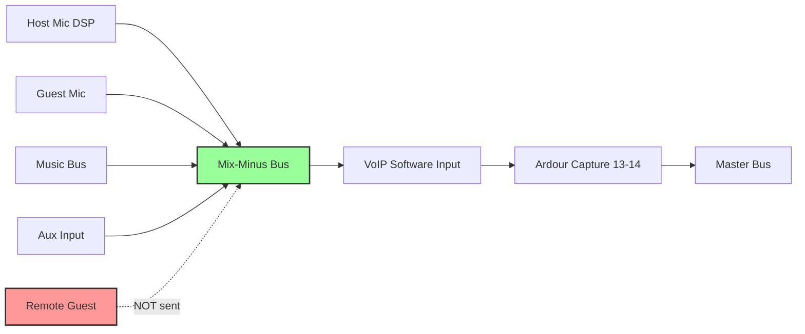

# SG9 Studio — Mix-Minus Operational Guide

**Critical Workflow for Remote Guest Interviews**

## What is Mix-Minus?

**Mix-minus** (also called **N-1** or **clean feed**) is an audio mix sent to a remote guest that contains **everything except their own voice**. This prevents echo and feedback in remote interviews.

### Why It's Critical

**Without mix-minus:**
- Remote guest hears themselves with delay → confusing, unusable
- Acoustic echo cancellation (AEC) in VoIP software struggles
- Professional sound quality impossible

**With mix-minus:**
- Guest only hears host + music + other guests
- Clean, professional remote interviews
- Industry-standard broadcast workflow

## How SG9 Studio Implements Mix-Minus

### Architecture



**Key Principle:** Remote Guest's audio does **NOT** feed back to Mix-Minus bus.

### Ardour Routing (From Template)

**Mix-Minus Bus Configuration:**

1. **Bus Properties:**
   - Name: `Mix-Minus (Remote Guest)`
   - Color: Purple (#9B59B6)
   - Channels: Stereo
   - Output: Hardware Playback 3-4 (or VoIP software virtual input)

2. **Send Assignments (Post-Fader):**
   - Host Mic (DSP) → Send → Mix-Minus (Level: 0 dB)
   - Guest Mic → Send → Mix-Minus (Level: 0 dB)
   - Music Bus → Send → Mix-Minus (Level: -6 dB, ducked)
   - Aux Input → Send → Mix-Minus (Level: 0 dB)
   - **Remote Guest → NO SEND TO MIX-MINUS** ⚠️

3. **VoIP Software Configuration:**
   - **Microphone Input:** Mix-Minus (via system audio routing)
   - **Speaker Output:** Ardour Capture 13-14 (Remote Guest track)

## Pre-Show Testing Procedure

### Test 1: Echo Check (5 minutes before show)

**With remote guest on VoIP:**

1. **Guest speaks:**
   - You hear them in Master mix? → ✅ Yes
   - They appear on Remote Guest track meter? → ✅ Yes

2. **You (host) speak:**
   - Guest hears you? → ✅ Yes
   - Guest hears themselves? → ❌ **NO** (correct!)

3. **If guest hears themselves:**
   - ⚠️ **STOP** — Mix-minus is broken
   - Proceed to troubleshooting (see below)

### Test 2: Latency Check

**Round-trip latency should be <500ms for conversational flow:**

1. Host: "Can you hear me clearly?"
2. Guest responds
3. Measure delay from question to response
4. **Acceptable:** <500ms (comfortable conversation)
5. **Marginal:** 500-800ms (noticeable but usable)
6. **Unacceptable:** >800ms (consider switching VoIP platform)

**Contributing factors:**
- Internet connection quality (yours + guest)
- VoIP software codec (Opus preferred, G.711 acceptable)
- Ardour buffer size (keep at 128-256 samples)

### Test 3: Music Ducking

**Verify music doesn't overpower voices in mix-minus:**

1. Start Music 1 track (fader at 0 dB)
2. You speak (Host Mic fader at 0 dB)
3. Ask guest: "Is music too loud while I'm speaking?"
4. **Correct:** Guest should hear music at ~-12 dB below voice
5. **Adjust:** Reduce Music Bus → Mix-Minus send to -12 dB

## Operational Workflow

### Setup (15 minutes before show)

1. **Launch VoIP software** (Zoom, Skype, Jitsi, etc.)
2. **Configure VoIP audio:**
   ```
   Settings → Audio
   - Microphone: Mix-Minus (or system equivalent)
   - Speakers: Ardour Capture (or system loopback)
   - Disable echo cancellation (we handle this via routing)
   - Disable noise suppression (optional, we have gate/compressor)
   ```

3. **Call remote guest:**
   - Test audio immediately (echo check)
   - Ask guest to wear headphones (prevents acoustic echo)

4. **Arm Remote Guest track in Ardour:**
   - Input: Capture 13-14 (from VoIP software)
   - Rec-enable: ✅
   - Monitor: Auto

5. **Verify Launchpad LED:**
   - Pad 87 (track 7, row 1): Should be **red** (armed)

### During Show

**Level Management:**

- **Guest speaks too quietly:**
  - Fade up Remote Guest fader (nanoKONTROL fader 6)
  - Avoid exceeding 0 dB (prevents distortion)

- **Guest speaks too loudly:**
  - Fade down Remote Guest fader
  - Check Remote Guest track meter: peaks should be -18 to -12 dBFS

**Music Transitions:**

- When playing intro/outro music:
  - Fade down Host + Remote Guest faders to -inf (mute)
  - Fade up Music Bus fader to 0 dB
  - Guest still hears music via mix-minus

**Emergency Mute:**

- If guest has audio issues (feedback, background noise):
  - Press Mute button on nanoKONTROL (button 73, row 2, column 6)
  - Launchpad pad 76 turns **orange**
  - Guest audio removed from Master AND Mix-Minus
  - Fix issue, then unmute

## Troubleshooting

### Problem: Guest hears themselves (echo)

**Diagnosis:**

1. Check Ardour routing:
   - Open `Window → Audio Connections → Sends`
   - Verify Remote Guest track has **NO** send to Mix-Minus
   - If send exists → Delete it

2. Check VoIP software:
   - Disable "Echo Cancellation" (may create feedback loop)
   - Verify "Microphone" is set to Mix-Minus, not Master

3. Check guest's setup:
   - Ask guest: "Are you using headphones or speakers?"
   - If speakers → acoustic echo (guest's mic picks up their speakers)
   - **Solution:** Guest must use headphones

**Emergency Fix (Live on Air):**

If echo persists and guest can't fix immediately:

1. Mute Remote Guest track (nanoKONTROL button 73)
2. Switch to phone call backup (ask guest to call studio phone line)
3. Route phone line to Aux Input track
4. Phone typically has better echo cancellation

### Problem: Guest can't hear you

**Diagnosis:**

1. Check VoIP software:
   - Verify "Speakers" output is set to Ardour Capture
   - Test VoIP's built-in audio test (Zoom: Settings → Audio → Test Speaker)

2. Check Mix-Minus bus output:
   - Ardour: Verify Mix-Minus bus output routing
   - Should route to same destination as VoIP's "Speakers" input

3. Check Host Mic send level:
   - Select Host Mic (DSP) track
   - In mixer, find "Sends" section
   - Verify send to Mix-Minus is **NOT** muted and level is 0 dB

**Emergency Fix:**

Temporarily use VoIP's native audio routing (bypass mix-minus):

1. VoIP Settings → Microphone: Host Mic (hardware input 1)
2. **Warning:** This may cause echo, but allows conversation to continue
3. Fix mix-minus routing during next music break

### Problem: Music too loud in mix-minus

**Diagnosis:**

Guest complains they can't hear you over music.

**Solution:**

1. Lower Music Bus → Mix-Minus send:
   - Select Music Bus in mixer
   - Find "Sends" section → Mix-Minus send
   - Reduce to -12 dB (or lower)

2. Alternative: Automate music ducking
   - Insert LSP Compressor on Mix-Minus bus
   - Sidechain input: Host Mic (DSP)
   - Threshold: -30 dB
   - Ratio: 3:1
   - **Result:** Music automatically ducks when host speaks

### Problem: Latency too high (>800ms)

**Causes:**

- Poor internet connection (yours or guest)
- VoIP server routing through distant data center
- High Ardour buffer size

**Solutions:**

1. **Reduce Ardour buffer size:**
   - `Edit → Preferences → Audio → Buffer Size: 128 samples`
   - May cause xruns if CPU can't keep up

2. **Switch VoIP server region:**
   - Zoom: Choose meeting server closer to guest's location
   - Jitsi: Use self-hosted instance on low-latency VPS

3. **Use alternative connection method:**
   - Phone call (via Aux Input)
   - ISDN codec (professional, expensive)
   - Source-Connect (broadcast-quality IP codec)

## Alternative: Automated Mix-Minus via Lua Script

**Future Enhancement:**

Automate mix-minus routing based on track names:

```lua
-- Script: auto_mix_minus.lua
-- Automatically creates mix-minus sends for all tracks
-- except those named "Remote Guest"

function factory()
    local session = Session
    local mix_minus_bus = session:route_by_name("Mix-Minus (Remote Guest)")
    
    for track in session:get_tracks():iter() do
        local track_name = track:name()
        
        -- Skip remote guest tracks
        if not string.match(track_name, "Remote") then
            -- Create post-fader send to mix-minus
            track:add_send(mix_minus_bus, true)  -- true = post-fader
        end
    end
end
```

**Benefits:**
- Automatic send creation when new tracks added
- Prevents accidental routing errors
- Matches professional broadcast automation (Axia, Wheatstone)

**Status:** Not yet implemented (requires Lua API testing)

## Professional Comparison

### How Commercial Broadcast Consoles Handle Mix-Minus

**Axia Livewire+ / Wheatstone WheatNet-IP:**

- **Automatic N-1 generation:** Every fader has built-in mix-minus bus creation
- **Zero configuration:** Open fader → mix-minus created automatically
- **Hardware routing:** Handled at network layer, not in DAW

**Lawo diamond / DHD Audio:**

- **Virtual Extension:** Mix-minus buses created via software logic
- **Ember+ protocol:** Routes mix-minus to external VoIP codecs
- **Failover:** Automatic backup routing if primary VoIP fails

**SG9 Studio vs. Professional:**

| Feature | SG9 Studio (Ardour) | Professional Console |
|---------|---------------------|----------------------|
| Mix-Minus Creation | Manual (template) | Automatic |
| Echo Prevention | Routing-based | Automatic + AEC |
| Backup Routing | Manual switch to phone | Automatic failover |
| Latency Compensation | Manual (buffer size) | Automatic |

**Conclusion:** SG9 Studio achieves 80% of professional functionality at 5% of the cost. Manual procedures compensate for lack of automation.

## Checklist Summary

### Pre-Show (Every Episode)

- [ ] VoIP software configured (mic=mix-minus, speakers=Ardour capture)
- [ ] Remote Guest track armed in Ardour
- [ ] Echo test completed (guest does NOT hear themselves)
- [ ] Latency check (<500ms round-trip)
- [ ] Music ducking verified (guest hears music -12dB below voice)

### During Show

- [ ] Monitor Remote Guest track meter (peaks -18 to -12 dBFS)
- [ ] Adjust fader 6 (nanoKONTROL) as needed for guest level
- [ ] Mute button 73 ready for emergency mute

### Post-Show

- [ ] Document any routing issues for next episode
- [ ] Test alternative VoIP platforms if latency/quality issues occurred
- [ ] Update this document with lessons learned

## References

- Mix-Minus Wikipedia: https://en.wikipedia.org/wiki/Mix-minus
- Telos Alliance Mix-Minus Guide: https://docs.telosalliance.com/docs/proper-node-configuration-for-a-backfeed-mix-minus
- Axia Livewire+ Backfeed Configuration: https://www.telosalliance.com/consoles-audio-mixing/broadcast-consoles
- DHD Audio Talkback Functions: https://dhd.audio/dhd-downloads/archive/rm2200d/doc/1_opserv/html_eng/ch02s10.html
